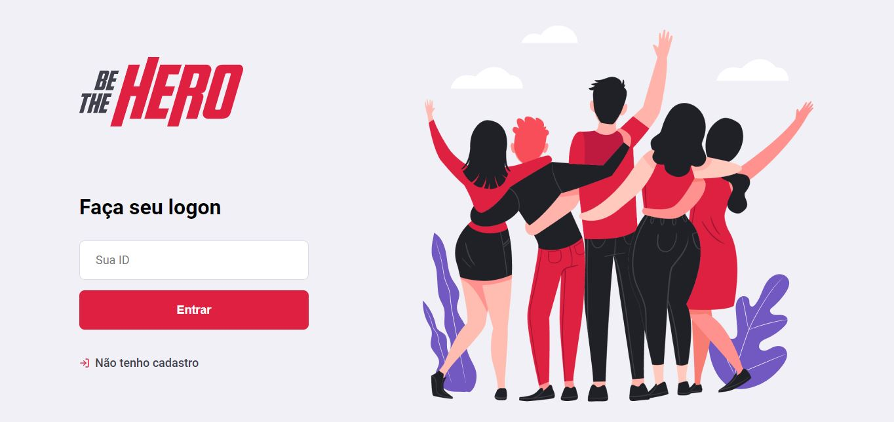
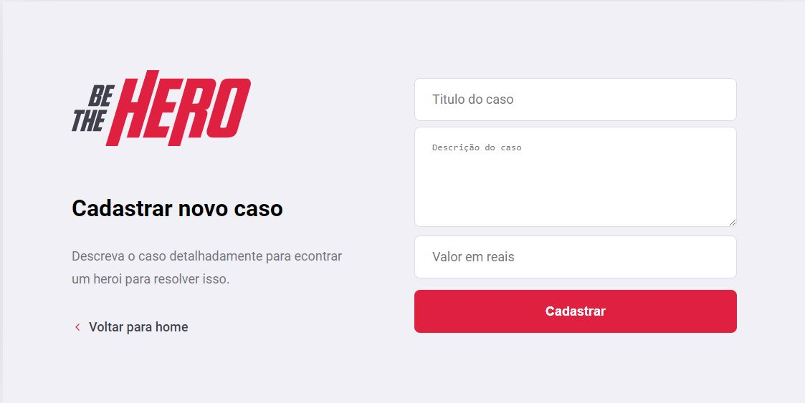
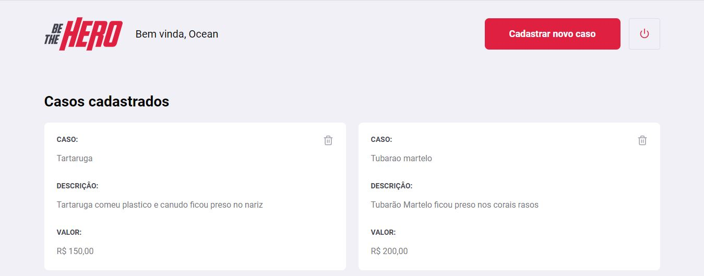
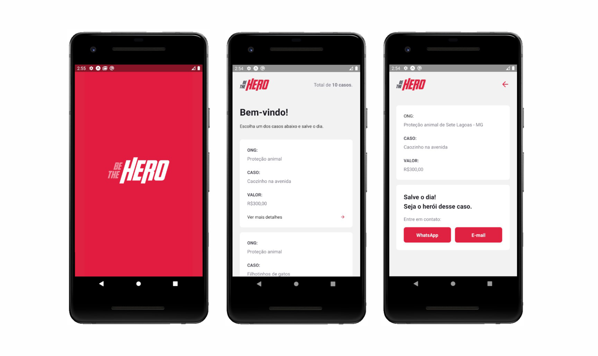

<h1 align="center">
    
</h1>

<h3 align="center">
  Um projeto da Semana OmniStack 11.0
</h3>
<h4 align="center">O Be The Hero visa ajudar instituições a encontrar colaboradores.</h4>

 

### Tecnologias

Esse projeto foi desenvolvido com as seguintes tecnologias:

- [NodeJS](https://nodejs.org/en/)
- [ReactJS](https://reactjs.org)
- [React Native](https://facebook.github.io/react-native/)
- [Expo](https://expo.io/)

### Aplicação Web
<h1 align="center">
    
  
    
</h1>

### Aplicação Mobile
<h1 align="center">
    
</h1>

### Como contribuir

- Faça um fork desse repositório;
- Cria uma branch com a sua feature: `git checkout -b minha-feature`;
- Faça commit das suas alterações: `git commit -m 'feat: Minha nova feature'`;
- Faça push para a sua branch: `git push origin minha-feature`.

Depois que o merge da sua pull request for feito, você pode deletar a sua branch.
 

Base desenvolvida por <strong>Thauê Alfredo</strong>
